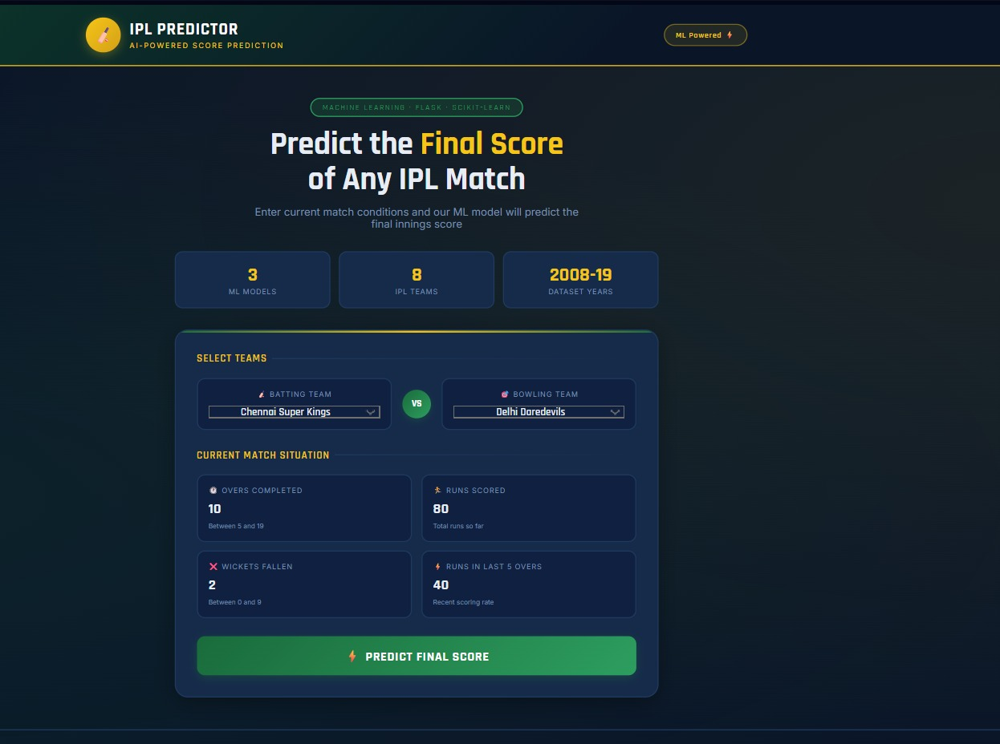
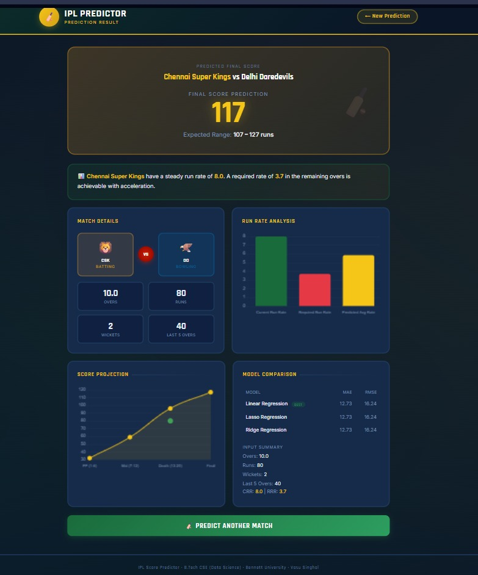

# 🏏 IPL Score Predictor

A machine learning web application that predicts the final score of an IPL batting team based on current match conditions — built with Python, Flask, and Scikit-learn.

**B.Tech CSE (Data Science) Project · Bennett University**

---

## 🚀 Live Demo

👉 👉 **[Click here to view the live project](https://ipl-score-predictor-0e6k.onrender.com)**

---

## 📸 Screenshots

### Home Page


### Prediction Result


---

## ✨ Features

- 🎯 Predicts final innings score based on current match situation
- 🤖 3 ML models compared: Linear, Lasso, Ridge Regression
- 📊 Interactive charts: Run Rate + Score Projection
- 🏏 8 consistent IPL teams (2008–2019 data)
- 💻 Two-page Flask app (index + result)
- 🚀 Deployed on Render

---

## 🛠️ Tech Stack

| Layer | Technology |
|---|---|
| Backend | Python 3, Flask |
| ML Models | Scikit-learn (Linear, Lasso, Ridge Regression) |
| Data Processing | Pandas, NumPy |
| Frontend | HTML, CSS, JavaScript, Chart.js |
| Deployment | Render (Gunicorn) |

---

## 📁 Project Structure

```
ipl_score_predictor/
│
├── app.py                  ← Flask backend + prediction routes
├── generate_data.py        ← IPL dataset generator
├── train_model.py          ← Model training (Linear/Lasso/Ridge)
├── requirements.txt        ← Python dependencies
├── run.bat                 ← One-click Windows launcher
├── README.md
│
├── data/
│   └── ipl_data.csv        ← Generated IPL dataset
│
├── models/
│   ├── model.pkl           ← Best trained model
│   ├── feature_cols.pkl    ← Feature column names
│   └── all_results.pkl     ← All model metrics
│
└── templates/
    ├── index.html          ← Input form page
    └── result.html         ← Prediction result page
```

---

## ⚙️ How to Run Locally (Windows)

### Option 1 — One Click
Double click `run.bat` → everything runs automatically!

### Option 2 — Manual
```bash
pip install -r requirements.txt
python generate_data.py
python train_model.py
python app.py
```
Open: http://localhost:5000

---

## 🧠 Methodology

### Data Preprocessing
- Filtered 8 consistent IPL teams
- Removed data with < 5 overs completed
- One-hot encoding for categorical variables
- Train: 2008–2016 | Test: 2017+

### Models Used
```
Linear Regression  → Baseline model
Lasso Regression   → Feature selection + regularization (GridSearchCV)
Ridge Regression   → Handles multicollinearity (GridSearchCV)
```

### Features
```
- Batting Team (one-hot encoded)
- Bowling Team (one-hot encoded)
- Overs completed
- Runs scored
- Wickets fallen
- Runs in last 5 overs
```

---


---

## 👤 Author

**Vasu Singhal** — B.Tech CSE (Data Science) — Bennett University

[](https://www.linkedin.com/in/vasu-singhal-46659a310)
[](https://github.com/Vasu-singhal01)

---

## 📄 License

MIT License — free to use and modify.
